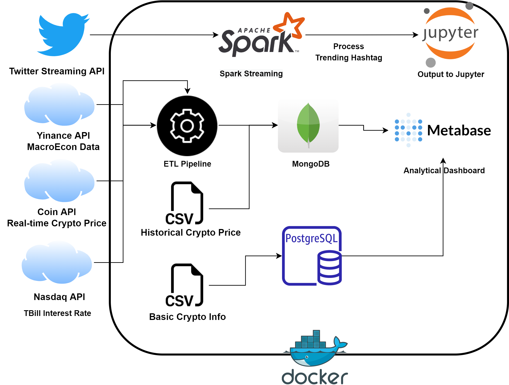

# Finance Monitor
APAN 5400 final project

The idea of this project is to create an information retrieval system which visualizes and analyzes the cryptocurrency data.

Here is our system architecture:

The project consists of four parts:

### Spark Streaming:

In this project, we build a TCP socket using python and receive the tweets from the Twitter Streaming API. Spark Streaming process real-time tweets
to get the trending hashtags about crpytocurrency. Finally, the output is printed in jupyterLab.

### Mongodb:
The [ETL pipeline](https://github.com/bloodandpoison/5400FinalProject/tree/main/src) feteches 
real-time crypto data from Coin API and then stores it in mongodb.

Also, historical crypto data and other APi data are stored in mongodb.

### Metabase
A open source analytical dashboard for analyzing and visualizing crypto data.
[Metabase Official Website](https://www.metabase.com/).

### PostgreSQL
Some high level information like name, creator, description about crypto are stored in PostgreSQL.

## Docker
Since our project consists of different components, we use docker to run multiple containers as the same time.

In [docker-compose.yml](https://github.com/bloodandpoison/5400FinalProject/blob/main/docker-compose.yml), we
configure our [ETL pipeline](https://github.com/bloodandpoison/5400FinalProject/tree/main/src)
,Pyspark notebook image, Mongodb image,
PostgreSQL image, and Metabase dashboard image.


To run this project, type the following commands in the terminal:
```
docker compose build
docker compose up -d # run in background
```

